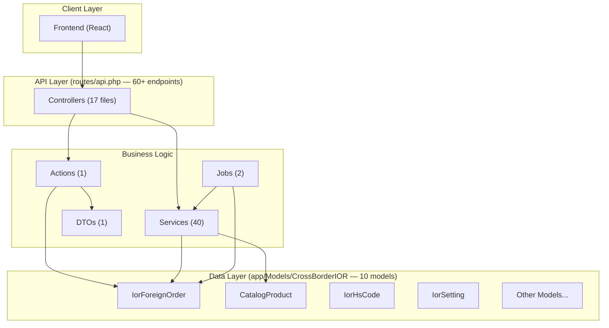
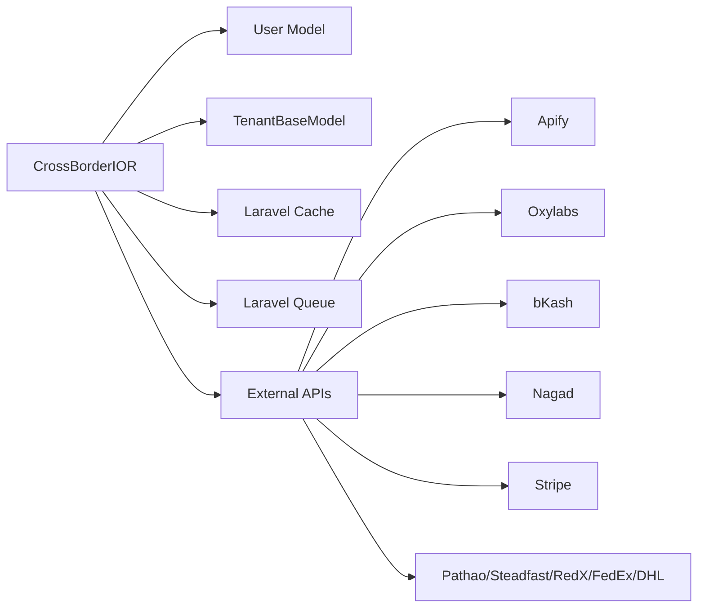

# 🌐 Cross-Border IOR Module — Complete Reference

> [!IMPORTANT]
> **Module Key**: `cross_border_ior` | **Version**: `1.0.0` | **Category**: Marketplace
>
> Customers paste a product URL from Amazon/eBay/Walmart/Alibaba and receive door delivery in BDT (Bangladeshi Taka).

---

## 📐 Architecture Diagram



---

## 📂 Directory Structure (Complete File Listing)

```
app/Modules/CrossBorderIOR/
├── module.json                           # Module metadata & feature flags
├── DOCUMENTATION.md                      # This file
├── module_task.md                        # Task & maintenance log
│
├── Actions/
│   └── CalculateIorPricingAction.php     # Core pricing engine
│
├── Commands/                             # (Empty — reserved for Artisan commands)
│
├── Controllers/
│   ├── Api/                              # (Empty — reserved for versioned API)
│   ├── AdminApprovalController.php       # Product approval workflow
│   ├── AiContentController.php           # AI content generation endpoints
│   ├── BillingController.php             # Wallet & top-up management
│   ├── CourierController.php             # Tracking & courier booking
│   ├── CourierWebhookController.php      # Courier status webhooks
│   ├── DashboardController.php           # IOR analytics dashboard
│   ├── ForeignOrderController.php        # Order CRUD & lifecycle
│   ├── HsCodeController.php             # HS Code search & selection
│   ├── InvoiceController.php             # Invoice generation & download
│   ├── IorScraperDashboardController.php # Scraper health & debug
│   ├── IorWarehouseController.php        # Warehouse ops (receive/dispatch)
│   ├── LandlordIorAdminController.php    # Super-admin: global IOR config
│   ├── NagadController.php               # Nagad payment gateway
│   ├── PaymentController.php             # bKash + SSLCommerz
│   ├── ProductScraperController.php      # URL scraping & catalog
│   ├── SettingsController.php            # Tenant-level IOR settings
│   └── StripeController.php              # Stripe Checkout integration
│
├── DTOs/
│   └── IorPricingDTO.php                 # Immutable pricing input object
│
├── Jobs/
│   ├── SyncForeignProductJob.php         # Background product sync (rate-limited)
│   └── SyncShipmentOrderJob.php          # Auto-poll courier for status updates
│
├── Policies/                             # (Empty — reserved for authorization)
│
├── Services/                             # 40 specialized service classes
│   ├── AiContentService.php
│   ├── ApifyScraperService.php
│   ├── BestsellersService.php
│   ├── BkashPaymentService.php
│   ├── BlockedSourceService.php
│   ├── BulkPriceRecalculatorService.php
│   ├── BulkProductImportService.php
│   ├── ComplianceSafetyService.php
│   ├── CourierBookingService.php
│   ├── CourierTrackingService.php
│   ├── CustomsDutyService.php
│   ├── ExchangeRateNotificationService.php
│   ├── ExchangeRateService.php
│   ├── ForeignProductSyncService.php
│   ├── GlobalCourierService.php
│   ├── GlobalDutyService.php
│   ├── GlobalGovernanceService.php
│   ├── IorAuditService.php
│   ├── IorMilestoneService.php
│   ├── IorScraperHealthService.php
│   ├── LandedCostCalculatorService.php
│   ├── NagadPaymentService.php
│   ├── OrderMilestoneService.php
│   ├── OrderNotificationService.php
│   ├── PriceAnomalyService.php
│   ├── ProductApprovalService.php
│   ├── ProductImageAnalysisService.php
│   ├── ProductMediaService.php
│   ├── ProductPricingCalculator.php
│   ├── ProformaInvoiceService.php
│   ├── ProxyRegistryService.php
│   ├── PythonScraperService.php
│   ├── RestockAlertService.php
│   ├── ScraperBillingService.php
│   ├── ShipmentBatchService.php
│   ├── ShippingEngineService.php
│   ├── StripePaymentService.php
│   ├── WarehouseMarginCalculator.php
│   ├── WebhookDispatcherService.php
│   └── WebhookVerificationService.php
│
└── routes/
    └── api.php                           # All route definitions
```

---

## 🗄️ Data Models — Complete Field Reference

### 1. IorForeignOrder

> The central model. Tracks the full lifecycle of an international order from paste-URL to door-delivery.

| Field | Type | Purpose |
| :--- | :--- | :--- |
| `order_number` | `string` | Auto-generated (`FPO-YYYYMMDD-00001`) |
| `user_id` | `FK → users` | Authenticated buyer |
| `guest_name/email/phone` | `string` | Guest checkout support |
| `product_url` | `string` | Source URL (Amazon, eBay, etc.) |
| `product_name` | `string` | Scraped product title |
| `product_category` | `string` | For customs classification |
| `product_weight_kg` | `decimal:3` | Default: 0.500 kg |
| `product_features` | `JSON array` | Scraped bullet points |
| `product_specs` | `JSON array` | Technical specifications |
| `quantity` | `integer` | Units ordered |
| `product_variant` | `string` | Size/Color/etc. |
| `product_image_url` | `string` | Thumbnail |
| `source_marketplace` | `string` | amazon, ebay, walmart, alibaba |
| `source_price_usd` | `decimal:2` | Original USD price |
| `exchange_rate` | `decimal:4` | USD→BDT rate at time of order |
| `base_price_bdt` | `decimal:2` | `source_price_usd × exchange_rate` |
| `customs_fee_bdt` | `decimal:2` | Calculated duty |
| `shipping_cost_bdt` | `decimal:2` | International + local shipping |
| `profit_margin_bdt` | `decimal:2` | Business margin |
| `estimated_price_bdt` | `decimal:2` | Pre-confirmation estimate |
| `final_price_bdt` | `decimal:2` | Final locked price |
| `advance_amount` | `decimal:2` | Upfront payment required |
| `remaining_amount` | `decimal:2` | Balance due on delivery |
| `advance_paid` | `boolean` | Payment status flag |
| `remaining_paid` | `boolean` | Payment status flag |
| `payment_method` | `string` | bkash, nagad, stripe, sslcommerz |
| `payment_status` | `string` | pending, paid, failed, refunded |
| `shipping_*` | `string` | Full shipping address fields |
| `tracking_number` | `string` | Courier tracking ID |
| `courier_code` | `string` | fedex, pathao, steadfast, etc. |
| `order_status` | `string` | Status constants (see below) |
| `scraped_data` | `JSON` | Raw scraper payload |
| `pricing_breakdown` | `JSON` | Detailed cost breakdown |
| `shipped_at/delivered_at/cancelled_at` | `datetime` | Lifecycle timestamps |

**Status Constants**:
```
pending → sourcing → ordered → shipped → customs → delivered
                                                  → cancelled
```

**Relationships**: `user()` → BelongsTo User, `transactions()` → HasMany IorTransactionLog

---

### 2. CatalogProduct

> Cached scraped products for storefront browsing.

| Field | Type | Purpose |
| :--- | :--- | :--- |
| `name` | `string` | Product title |
| `slug` | `string` | URL-friendly identifier |
| `description/short_description` | `text` | Product details |
| `price` | `decimal:2` | Original price (USD) |
| `price_bdt` | `decimal:2` | Converted BDT price |
| `currency` | `string` | Source currency |
| `thumbnail_url` | `string` | Main image |
| `images` | `JSON array` | Gallery URLs |
| `brand` | `string` | Brand name |
| `sku` | `string` | Source SKU |
| `availability` | `string` | In stock / Out of stock |
| `status` | `string` | active, pending, archived |
| `product_type` | `string` | Product category |
| `attributes` | `JSON` | Color, size, weight, etc. |

**Traits**: `SoftDeletes`

---

### 3. IorSetting

> Key-value config store with caching.

| Field | Type | Purpose |
| :--- | :--- | :--- |
| `key` | `string` | Setting identifier |
| `value` | `mixed` | Setting value |
| `group` | `string` | Logical grouping (general, pricing, shipping) |

**Static Methods**:
- `get(key, default)` — Cached retrieval (1hr TTL)
- `set(key, value, group)` — Update + cache invalidation
- `getByGroup(group)` — All settings in a group

---

### 4. IorHsCode

> Harmonized System codes for customs duty calculation.

| Field | Type | Purpose |
| :--- | :--- | :--- |
| `hs_code` | `string` | Official HS code (e.g., `8471.30`) |
| `category_name` | `string` | Human-readable category |
| `description` | `text` | Code description |
| `duty_rate` | `decimal:2` | Customs duty % |
| `vat_rate` | `decimal:2` | VAT % |
| `ait_rate` | `decimal:2` | Advance Income Tax % |
| `is_active` | `boolean` | Toggle |

---

### 5. IorWarehouse

> Physical sorting/fulfillment center nodes.

| Field | Type | Purpose |
| :--- | :--- | :--- |
| `name` | `string` | Warehouse name |
| `location_type` | `enum` | `source`, `transit`, `destination` |
| `address` | `text` | Physical address |
| `contact_person` | `string` | Manager name |
| `contact_phone` | `string` | Manager phone |
| `is_active` | `boolean` | Toggle |

**Relationships**: `currentOrders()` → HasMany IorForeignOrder

---

### 6. IorShipmentBatch

> Groups orders for cost-efficient bulk shipping.

| Field | Type | Purpose |
| :--- | :--- | :--- |
| `batch_number` | `string` | Unique batch ID |
| `courier_name` | `string` | Carrier name |
| `master_tracking_number` | `string` | Master AWB |
| `status` | `enum` | pending, in_transit, customs, received, dispatched |
| `shipment_type` | `enum` | `air`, `sea` |
| `estimated_delivery` | `date` | ETA |
| `total_weight` | `decimal:3` | Combined weight (kg) |
| `notes` | `text` | Internal notes |

**Relationships**: `orders()` → HasMany IorForeignOrder

---

### 7. IorCustomsRate

> Category-based customs duty rates.

| Field | Type |
| :--- | :--- |
| `category` | `string` |
| `rate_percentage` | `decimal:2` |
| `is_active` | `boolean` |

---

### 8. IorShippingSetting

> Per-method shipping cost configuration.

| Field | Type |
| :--- | :--- |
| `shipping_method` | `string` (air/sea) |
| `rate_per_kg` | `decimal:2` |
| `min_charge` | `decimal:2` |
| `is_active` | `boolean` |

---

### 9. IorCourierConfig

> Courier API credentials and settings.

| Field | Type |
| :--- | :--- |
| `courier_code` | `string` (fedex/pathao/steadfast) |
| `display_name` | `string` |
| `type` | `string` |
| `credentials` | `JSON` (API keys, secrets) |
| `is_active` | `boolean` |

---

### 10. IorTransactionLog

> Payment transaction audit trail.

| Field | Type | Purpose |
| :--- | :--- | :--- |
| `order_id` | `FK → ior_foreign_orders` | Parent order |
| `transaction_id` | `string` | Gateway transaction ref |
| `payment_method` | `string` | bkash, nagad, stripe, etc. |
| `amount` | `decimal:2` | Amount paid |
| `status` | `string` | success, failed, pending |
| `payload` | `JSON` | Raw gateway response |

**Relationships**: `order()` → BelongsTo IorForeignOrder

---

## ⚡ Business Logic Components

### Action: CalculateIorPricingAction
The core pricing engine. Takes an `IorPricingDTO` and returns a complete pricing breakdown.

**Formula**:
```
Base (BDT)     = USD Price × Exchange Rate
Customs (BDT)  = Base × (Customs Rate %)
Shipping (BDT) = max(Weight × Rate/kg, Minimum Charge)
Warehouse      = Fixed fee from settings (default: ৳150)
Margin (BDT)   = (Base + Customs + Shipping + Warehouse) × Margin %
─────────────────────────────────────────────────────────
Final Price    = ceil(Base + Customs + Shipping + Warehouse + Margin)
```

**Advance Payment Tiers**:
| Final Price Range | Advance % |
| :--- | :--- |
| > ৳100,000 | 100% |
| > ৳50,000 | 70% |
| > ৳20,000 | 60% |
| ≤ ৳20,000 | Default (50%) |

---

### DTO: IorPricingDTO
Immutable input object for pricing calculations.

| Property | Type | Default |
| :--- | :--- | :--- |
| `usdPrice` | `float` | required |
| `weightKg` | `float` | 0.5 |
| `productTitle` | `string` | `''` |
| `shippingMethod` | `string` | `'air'` |
| `customRate` | `?float` | `null` (auto-detect) |
| `marginRate` | `?float` | `null` (use default) |

---

### Job: SyncForeignProductJob
Background product price synchronization with rate limiting.
- **Queue**: Default
- **Provider**: Oxylabs (default) or Apify
- **Logic**: Iterates product IDs, checks budget via `ScraperBillingService`, syncs via `ForeignProductSyncService`, respects rate limit.

### Job: SyncShipmentOrderJob
Auto-polls courier APIs for shipment status updates.
- **Trigger**: Scheduled or manual
- **Logic**: Tracks via `CourierTrackingService`, updates `order_status`, logs events to `ior_logs`, sends notifications via `OrderNotificationService`.

---

## 🔌 Service Index (40 Services)

### 💰 Financial & Pricing
| Service | Purpose |
| :--- | :--- |
| `ExchangeRateService` | Real-time USD→BDT conversion |
| `ExchangeRateNotificationService` | Alerts on significant rate changes |
| `LandedCostCalculatorService` | Full landed cost computation |
| `ProductPricingCalculator` | Product-level price determination |
| `BulkPriceRecalculatorService` | Batch price updates on rate change |
| `WarehouseMarginCalculator` | Per-warehouse margin computation |
| `PriceAnomalyService` | Detects unusual pricing patterns |

### 📦 Logistics & Fulfillment
| Service | Purpose |
| :--- | :--- |
| `CourierBookingService` | Multi-carrier parcel creation (Pathao, Steadfast, RedX, FedEx, DHL) |
| `CourierTrackingService` | Unified tracking across carriers |
| `ShipmentBatchService` | Batch grouping optimization |
| `ShippingEngineService` | Shipping rate calculation |
| `GlobalCourierService` | Global carrier configuration |

### 🕵️ Sourcing & Scraping
| Service | Purpose |
| :--- | :--- |
| `ApifyScraperService` | Cloud scraping via Apify |
| `PythonScraperService` | Local Python scraper integration |
| `ForeignProductSyncService` | Product data synchronization |
| `BulkProductImportService` | Bulk URL import (max 10/request) |
| `BestsellersService` | Trending product discovery |
| `IorScraperHealthService` | Scraper uptime monitoring |
| `ScraperBillingService` | Scraping budget enforcement |
| `ProxyRegistryService` | Rotating proxy management |

### 💳 Payment Gateways
| Service | Purpose |
| :--- | :--- |
| `BkashPaymentService` | bKash mobile payment flow |
| `NagadPaymentService` | Nagad mobile payment flow |
| `StripePaymentService` | Stripe Checkout Sessions |

### 🤖 AI & Content
| Service | Purpose |
| :--- | :--- |
| `AiContentService` | GPT/Claude-powered content generation |
| `ProductImageAnalysisService` | AI image analysis and tagging |
| `ProductMediaService` | Media asset management |

### 🛡️ Compliance & Governance
| Service | Purpose |
| :--- | :--- |
| `CustomsDutyService` | HS Code-based duty calculation |
| `GlobalDutyService` | Multi-country duty rates |
| `GlobalGovernanceService` | Trade policy enforcement |
| `ComplianceSafetyService` | Restricted item detection |
| `BlockedSourceService` | Blacklisted domain/SKU management |
| `ProductApprovalService` | Admin approval workflow |

### 📣 Notifications & Audit
| Service | Purpose |
| :--- | :--- |
| `OrderNotificationService` | Email/SMS/WhatsApp order updates |
| `OrderMilestoneService` | Order lifecycle event tracking |
| `IorMilestoneService` | Module-level milestone tracking |
| `IorAuditService` | Audit trail logging |
| `RestockAlertService` | Low-stock notifications |
| `WebhookDispatcherService` | Outbound webhook delivery |
| `WebhookVerificationService` | Inbound webhook HMAC verification |
| `ProformaInvoiceService` | Proforma invoice generation |

---

## 🛣️ API Route Map (60+ Endpoints)

### Public (No Auth)
| Method | Endpoint | Controller | Purpose |
| :--- | :--- | :--- | :--- |
| `GET` | `/ior/payment/bkash/callback` | PaymentController | bKash redirect |
| `POST` | `/ior/payment/sslcommerz/ipn` | PaymentController | SSLCommerz IPN |
| `POST` | `/ior/payment/stripe/webhook` | StripeController | Stripe webhook |
| `GET` | `/ior/payment/nagad/callback` | NagadController | Nagad redirect |
| `POST` | `/ior/payment/webhooks/{tenantId}/pathao` | CourierWebhookController | Pathao status |

### Authenticated (Tenant + User)

#### Dashboard
| Method | Endpoint | Purpose |
| :--- | :--- | :--- |
| `GET` | `/ior/dashboard` | Stats overview |
| `GET` | `/ior/dashboard/performance` | Performance metrics |

#### Product Scraping
| Method | Endpoint | Purpose |
| :--- | :--- | :--- |
| `POST` | `/ior/scrape` | URL → product + BDT price |
| `POST` | `/ior/quote` | Manual USD → BDT quote |
| `POST` | `/ior/simulate-cost` | Full landed cost simulation |
| `GET` | `/ior/catalog` | Browse imported catalog |

#### Orders (Core CRUD)
| Method | Endpoint | Purpose |
| :--- | :--- | :--- |
| `GET` | `/ior/orders` | List + filter + paginate |
| `POST` | `/ior/orders` | Place order (auto pricing) |
| `GET` | `/ior/orders/{id}` | Order detail |
| `PUT` | `/ior/orders/{id}` | Admin edit |
| `PUT` | `/ior/orders/{id}/status` | Status lifecycle transition |
| `DELETE` | `/ior/orders/{id}` | Delete order |

#### Payment Initiation
| Method | Endpoint | Purpose |
| :--- | :--- | :--- |
| `POST` | `/ior/payment/nagad/initiate` | Start Nagad flow |
| `POST` | `/ior/payment/bkash/initiate` | Start bKash flow |
| `POST` | `/ior/payment/sslcommerz/initiate` | Start SSLCommerz |
| `POST` | `/ior/payment/stripe/initiate` | Start Stripe Checkout |

#### Courier & Warehouse
| Method | Endpoint | Purpose |
| :--- | :--- | :--- |
| `POST` | `/ior/courier/book` | Auto-create parcel |
| `POST` | `/ior/courier/assign` | Attach tracking # to order |
| `GET` | `/ior/courier/track-order/{id}` | Track by order ID |
| `POST` | `/ior/warehouse/receive` | Inbound: mark arrived |
| `POST` | `/ior/warehouse/dispatch` | Outbound: dispatch |
| `POST` | `/ior/warehouse/customs-clear` | Mark customs cleared |

#### AI Content
| Method | Endpoint | Purpose |
| :--- | :--- | :--- |
| `POST` | `/ior/ai/generate-description` | AI product description |
| `POST` | `/ior/ai/optimize-seo` | SEO optimization |
| `POST` | `/ior/ai/analyze-image` | Image analysis |
| `POST` | `/ior/ai/translate` | Text → Bangla |
| `POST` | `/ior/ai/social` | Social media captions |

### Global (Landlord Admin)
| Method | Endpoint | Purpose |
| :--- | :--- | :--- |
| `GET/POST/DELETE` | `/ior/global/restricted-items` | Restricted item management |
| `GET/POST` | `/ior/global/couriers` | Global courier config |
| `GET/POST/PUT/DELETE` | `/ior/global/hs-codes` | HS Code CRUD |

---

## 🔗 Module Dependencies



---

> [!NOTE]
> This document was generated on 2026-02-22. For active development status and task tracking, see [module_task.md](file:///e:/Mern%20Stact%20Dev/multi-tenant-mern/multi-tenant-laravel/app/Modules/CrossBorderIOR/module_task.md).
