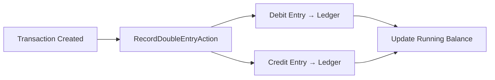

# 💰 Finance Module — Complete Reference

> **Module Key**: `finance` | Double-entry accounting, ledger, and financial reporting.
> Chart of accounts, double-entry transactions, income statements, and payroll integration.

---

## 📂 Directory Structure

```
app/Modules/Finance/
├── module.json
├── Actions/
│   ├── CreateAccountAction.php         # Chart of accounts: add account
│   ├── RecordDoubleEntryAction.php     # Post a double-entry transaction
│   ├── RecordSalaryExpenseAction.php   # Payroll → Finance bridge
│   └── GetIncomeStatementAction.php    # P&L report generation
├── Controllers/
│   ├── AccountController.php           # Account CRUD
│   ├── ReportController.php            # Financial reports
│   └── TransactionController.php       # Transaction listing
├── DTOs/ (2 files)
├── Services/
│   └── LedgerService.php               # Ledger calculations
└── routes/
    └── api.php
```

## 🗄️ Data Models (app/Models/Finance — 5 models)

| Model | Table | Key Fields | Relationships |
| :--- | :--- | :--- | :--- |
| `Account` | `fin_accounts` | `code`, `name`, `type`, `parent_id`, `is_active`, `opening_balance` | `parent()`, `children()`, `ledgerEntries()` |
| `Transaction` | `fin_transactions` | `reference`, `date`, `description`, `total_amount`, `created_by` | `ledgerEntries()`, `user()` |
| `Ledger` | `fin_ledger` | `transaction_id`, `account_id`, `debit`, `credit`, `running_balance` | `transaction()`, `account()` |
| `Currency` | `fin_currencies` | `code`, `name`, `symbol`, `exchange_rate`, `is_default` | — |
| `TaxConfig` | `fin_tax_configs` | `name`, `rate`, `type`, `is_inclusive`, `is_active` | — |

### Double-Entry Accounting Flow


---

See [module_task.md](file:///e:/Mern%20Stact%20Dev/multi-tenant-mern/multi-tenant-laravel/app/Modules/Finance/module_task.md)
