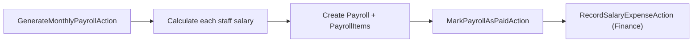

# 🧑‍💼 HRM Module — Complete Reference

> **Module Key**: `hrm` | Human Resource Management.
> Staff management, attendance, leave, payroll generation, and department organization.

---

## 📂 Directory Structure

```
app/Modules/HRM/
├── module.json
├── Actions/
│   ├── GenerateMonthlyPayrollAction.php  # Auto-generate monthly payroll for all staff
│   ├── MarkAttendanceAction.php          # Clock in/out tracking
│   ├── MarkPayrollAsPaidAction.php       # Mark payroll as paid + Finance integration
│   ├── StoreStaffAction.php              # Staff creation
│   └── UpdateStaffAction.php             # Staff update
├── Controllers/
│   ├── HrmController.php                 # Core HRM CRUD endpoints
│   └── PayrollController.php             # Payroll management
├── DTOs/ (1 file)
├── Services/
│   └── PayrollService.php                # Payroll calculations
└── routes/
    └── api.php
```

## 🗄️ Data Models (app/Models/HRM — 7 models)

| Model | Table | Key Fields | Relationships |
| :--- | :--- | :--- | :--- |
| `Staff` | `hr_staff` | `user_id`, `employee_id`, `department_id`, `position`, `salary`, `hire_date`, `status` | `user()`, `department()`, `attendances()`, `payrolls()`, `leaveRequests()` |
| `Department` | `hr_departments` | `name`, `code`, `manager_id`, `is_active` | `manager()`, `staff()` |
| `Attendance` | `hr_attendances` | `staff_id`, `date`, `clock_in`, `clock_out`, `hours_worked`, `status` | `staff()` |
| `LeaveRequest` | `hr_leave_requests` | `staff_id`, `type`, `start_date`, `end_date`, `days`, `status`, `approved_by` | `staff()`, `approver()` |
| `Payroll` | `hr_payrolls` | `staff_id`, `month`, `year`, `basic_salary`, `allowances`, `deductions`, `net_salary`, `status` | `staff()`, `items()` |
| `PayrollItem` | `hr_payroll_items` | `payroll_id`, `type`, `description`, `amount` | `payroll()` |
| `HrSetting` | `hr_settings` | `key`, `value`, `group` | — |

### Payroll Flow


---

See [module_task.md](file:///e:/Mern%20Stact%20Dev/multi-tenant-mern/multi-tenant-laravel/app/Modules/HRM/module_task.md)
